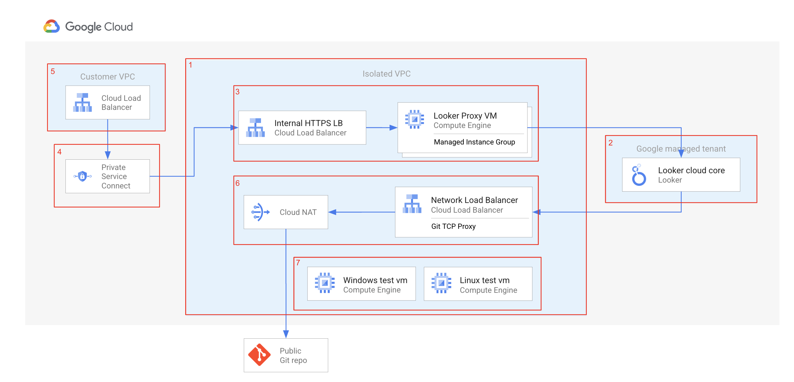

# Architecture overview

1. Vpc network configuration
    1. vpc network
    1. vpc subnetwors for ilb, psc, psa peering
    1. private service access connection
    1. firewall rules
1. looker-instance
    1. looker instance
    1. custom looker domain
1. looker-proxy
    1. nginx docker image with autogenerated nginx-proxy configuration
    1. vm template provisioned with nginx-proxy docker image
    1. lb configuration for mig with nginx-proxy vms
1. psc-producer 
    1. service attachment
1. psc-consumer
    1. lb pointing to the psc producer
1. git-proxy
    1. dns configuration to point to the external git repository
    1. lb to forward requests to external git repository
1. test-vms
    1. linux and windows vms deployed to the looker vpc to test connectivity

# OAuth authorization credentials
An OAuth client must be set up and OAuth credentials must be generated before Looker (Google Cloud core) instance creation
Follow (those steps)[https://cloud.google.com/looker/docs/looker-core-create-oauth#before_you_create_a_instance] to create OAuth authorization credentials.
Unfortunately as of now it is not possible to create OAuth authorization credentials via terraform

# Reference links
1. [Set up nginx proxy in fron of your private Looker instance](https://cloud.google.com/looker/docs/looker-core-private-ip-config#grant_public_access_to_private_ip_instances)
1. [Access to public Github repos over HTTPS for private Looker instance](https://docs.google.com/document/d/1YcokqVN7ktG73EirI57_111xKRtQckzTocVzZZ-Zs-s/edit?tab=t.0#heading=h.mi7dxo7e0yzg)(internal)

# Missing terraform resources

path: looker-proxy/git-proxy.tf:108
[google_compute_network_endpoint](https://registry.terraform.io/providers/hashicorp/google/latest/docs/resources/compute_network_endpoint) is not supporting ip address of an external resource

path: looker-proxy/git-proxy.tf:202
The nat endpoint-types must be ENDPOINT_TYPE_MANAGED_PROXY_LB
[google_compute_router_nat](https://registry.terraform.io/providers/hashicorp/google/latest/docs/resources/compute_router_nat) Currently (5.11.0) the endpoint-types field is not available in google terraform provider
[Github issue](https://github.com/hashicorp/terraform-provider-google/issues/17001)

# List needed permissions to apply terraform configuration:
<todo>

# List of required APIs:
<todo>

# TODO:
1. Move git-proxy to separate module
1. Generate looker sa with bq permissions as a part of terraform 
1. Switch from container registry to artifact registry
1. Use [google module](https://registry.terraform.io/modules/GoogleCloudPlatform/lb-http/google/latest?tab=inputs) for creating lb
1. Add (Looker Action Hub)[https://github.com/looker-open-source/actions]

